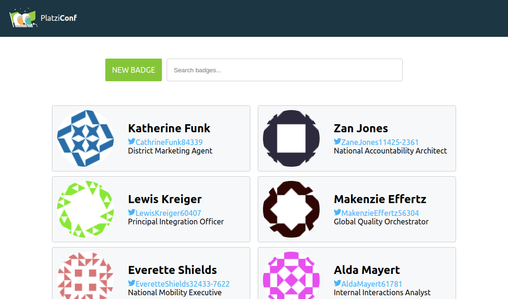

# Platzi Badges

## Conference Management System

Application to register the attendants to PlatziConf created with the knowledge earned in the ReactJS course at Platzi.

In the course, the UI was styled with Bootstrap but I wanted to try styled-components and I like them. Also, we just create the frontend and there isn't data persistence, I wanted to make some extra work and create the backend with the knowledge earned in the Backend with Node Course at Platzi.

I also implemented Redux in the project to manage the state and to practice how to work with Redux.

Demo:  [PlatziBadges](https://platzibadges-cra.now.sh)

⚡️ Quick Start

1. Clone the repository

- `git clone git@github.com:rubbenpad/platzi-badges.git`

2. Install dependecies

- `npm install`

3. Scripts

- `npm start` | Development
- `npm build && serve -s build` | Production
